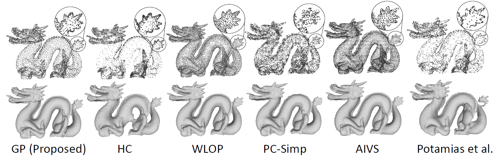

# GP-PCS: One-Shot Feature-Preserving Point Cloud Simplification with Gaussian Processes on Riemannian Manifolds [ICPR 2024 (Oral)]

Read our paper here:

[](https://doi.org/10.1007/978-3-031-78456-9_28)
[](https://arxiv.org/abs/2303.15225)

## 🔍 Overview

 We propose a novel, one-shot point cloud simplification method which preserves both the salient structural features and the overall shape of a point cloud without any prior surface reconstruction step. Our method employs Gaussian processes suitable for functions defined on Riemannian manifolds, allowing us to model the surface variation function across any given point cloud. A simplified version of the original cloud is obtained by sequentially selecting points using a greedy sparsification scheme. The selection criterion used for this scheme ensures that the simplified cloud best represents the surface variation of the original point cloud. 
 
 Below you can see the simplified representations of the Stanford Dragon (top row) and associated reconstructed meshes (bottom row) for all evaluated simplification techniques. Here GP is the simplification technique implemented in our paper.



## 🛠️ Setup

Environment setup instructions for Ubuntu and Windows via Conda are provided below:

### Windows

```bash
conda create -n pcs python=3.9
conda activate pcs
pip install torch==1.13.0+cu116 torchvision==0.14.0+cu116 torchaudio==0.13.0 --extra-index-url https://download.pytorch.org/whl/cu116
pip install "git+https://github.com/facebookresearch/pytorch3d.git"
conda install matplotlib
pip install gpytorch
pip install git+https://github.com/gpflow/geometrickernels.git
conda install -c dglteam/label/cu117 dgl
python -m pip install jakteristics 
pip install open3d
```

### Ubuntu 24

Step 1:
Download [CloudComPy binaries](https://www.simulation.openfields.fr/index.php/cloudcompy-downloads/3-cloudcompy-binaries/4-linux-cloudcompy-binaries/99-cloudcompy-conda310-linux64-20240420) in your working directory and unzip:

```bash
tar -xvzf CloudComPy_Conda310_Linux64_20240420.tgz 
```

Step 2:
```bash
# conda update -y -n base -c defaults conda
conda create --name pcs python=3.10 
conda activate pcs
conda config --add channels conda-forge 
conda config --set channel_priority strict 
conda install "boost=1.74" "cgal=5.4" cmake ffmpeg "gdal=3.5" jupyterlab laszip "matplotlib=3.5" "mysql=8.0" "numpy=1.22" "opencv=4.5" "openmp=8.0" "pcl=1.12" "pdal=2.4" "psutil=5.9" pybind11 "qhull=2020.2" "qt=5.15.4" "scipy=1.8" sphinx_rtd_theme spyder tbb tbb-devel "xerces-c=3.2" 
conda deactivate 
```

Step 3:
```bash
. CloudComPy310/bin/condaCloud.sh activate pcs 
pip3 install torch torchvision torchaudio 
pip install gpytorch 
pip install git+https://github.com/gpflow/geometrickernels.git 
pip install --pre dgl -f https://data.dgl.ai/wheels/cu117/repo.html 
pip install --pre dglgo -f https://data.dgl.ai/wheels-test/repo.html 
pip install numpy==1.26.4
```

## 🚀 Quick Start

### Windows:

```bash
git clone https://github.com/stutipathak5/gps-for-point-clouds.git
cd gps-for-point-clouds
conda activate pcs 
python demo.py
```

### Ubuntu 24

```bash
git clone https://github.com/stutipathak5/gps-for-point-clouds.git
cd gps-for-point-clouds
. CloudComPy310/bin/condaCloud.sh activate pcs 
python demo.py
```

For multiple point clouds, run_all.py can be used.

## 📝 Citation

Please consider citing the following if you find this work useful:

```bibtex
@inproceedings{pathak2025gp,
  title={GP-PCS: One-shot Feature-Preserving Point Cloud Simplification with Gaussian Processes on Riemannian Manifolds},
  author={Pathak, Stuti and Baldwin-McDonald, Thomas and Sels, Seppe and Penne, Rudi},
  booktitle={International Conference on Pattern Recognition},
  pages={436--452},
  year={2025},
  organization={Springer}
}
```


